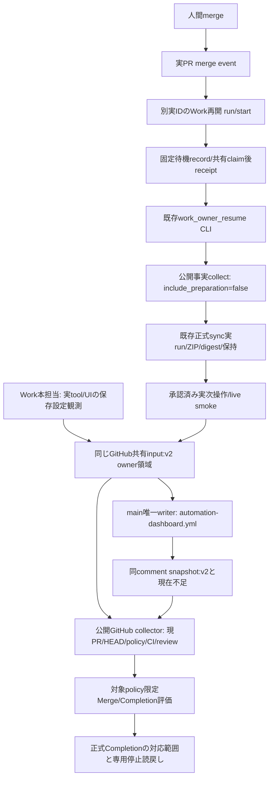

# I-01準備・再開の接続図（Issue #100）

snapshotはcacheで、Gateは現在owner/input/public factsから再計算する。
再開CLIの公開事実collectorは準備Gateを再呼出ししない。Work⇔CloudはGitHubの成果物と
元taskの正式UI回収経路を使い、直接専用APIを仮定しない。

| 経路 | 現在の成立範囲 |
|---|---|
| v2 input/owner/ledger/watermark/唯一writer/対象限定Gate | 候補実装・合成回帰済み。main適用/実共有更新未実証 |
| review登録・実受信 | 実ID `6ac71f9572a48191bbf36c742b9e1720` / PR101 / enabled / 詳細Prompt・外側Trigger両UI読戻し済み（設定第2版）。opened delivery `93e14870-c2da-11f1-89c4-eae7676d7dd1`、実Work開始05:39:15Z。run ID非公開UNKNOWN。最終HEAD binding/独立再照合は未完了 |
| owner_resume登録 | 別実ID `6ac72ce1c0888191b267e2ca1b3e6d54` / PR101 / merge-only / enabled / 詳細Prompt・外側Trigger両UI読戻し済み。owner実event/開始は未来未受信 |
| merge→Work開始→claim/receipt→同期→次操作 | 今回は未実証。PR99の過去イベント/手動回収を転用しない |
| 実main CLI/live smoke | tokenなし公開GETと正式plugin ZIP提供経路を候補補修。main適用後の実CLIは未実証 |
| 専用停止/enabled=false | 今回未実証 |

候補コードを正式writer/self-hostedへ読み込ませない。公開CI成功もmain正式稼働や実動成功ではない。

実登録状況の根拠: [Issue100本担当要約6052718244](https://github.com/tetsujisugimori-coder/LangBench-Live/issues/100#issuecomment-6052718244)、[独立開始6053175781](https://github.com/tetsujisugimori-coder/LangBench-Live/issues/100#issuecomment-6053175781)、[独立BLOCKED結果6053210723](https://github.com/tetsujisugimori-coder/LangBench-Live/issues/100#issuecomment-6053210723)。UI読戻しはowner attestationでありCloudがサービス内部を直接認証したものではない。Prompt全文/承認済みevents/最終HEADは本担当が同共有inputへ束縛する。
