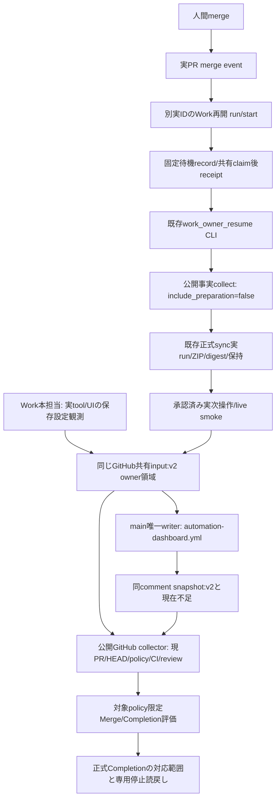

# I-01準備・再開の接続図（Issue #100）

snapshotはcacheで、Gateは現在owner/input/public factsから再計算する。
再開CLIの公開事実collectorは準備Gateを再呼出ししない。Work⇔CloudはGitHubの成果物と
元taskの正式UI回収経路を使い、直接専用APIを仮定しない。

| 経路 | 現在の成立範囲 |
|---|---|
| v2 input/owner/ledger/watermark/唯一writer/対象限定Gate | 候補実装・合成回帰済み。main適用/実共有更新未実証 |
| review保存設定 | 本担当が実UI読戻し済み。実PR bindingと全文入力の回収は未完了 |
| owner_resume登録 | 実PR/実ID未取得。未登録を合成IDで補わない |
| merge→Work開始→claim/receipt→同期→次操作 | 今回は未実証。PR99の過去イベント/手動回収を転用しない |
| 実main CLI/live smoke | tokenなし公開GETと正式plugin ZIP提供経路を候補補修。main適用後の実CLIは未実証 |
| 専用停止/enabled=false | 今回未実証 |

候補コードを正式writer/self-hostedへ読み込ませない。公開CI成功もmain正式稼働や実動成功ではない。
