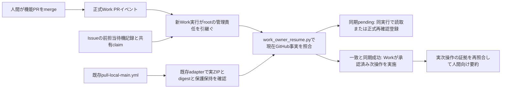

# Issue #96: I-01 本担当の再開接続

承認仕様: Issue #96本文全文（V3.8第1〜24節としてユーザーが確認）。
開始main: `cdede4db69e0b3494a75d2bc0a5a403b9ce33d55`。
実装task: `01a118c1-2cf7-73c6-a628-0c1407f710ce`、起動receipt: #96 comment 6049116117。
実装状態: 実装済み。今回の機能PR merge後の実動確認は未実施。
PREPARATION_COMPLETE・Merge/Completion Gate・実動成功はこの文書から認定しない。



元会話が直接再開される機能は使わない。正式Work実行が共有Issue記録を受領する。
PRイベント登録・Work起動・受領・同期完了・実次操作は別の証拠。
ActionsからWork/CloudをdispatchするAPIは追加しない。正式state/Gate writer、policy、
同期owner、測定データ、既存受入条件は変更しない。

## 正式Work登録と実行手順

1. Work(root)が今回の実機能PRの番号/current full HEADをGitHubから一意に取得。
   正式UIでこのrepository/実PR番号/closedのmerge限定条件（only_on_merge）/Promptを登録・読戻す。
   Issue #96へ実automation ID、enabled、Trigger/Condition/Prompt、権限、登録時刻を保存する。
   #98の前提merge登録 `6ac6cab4e328819194ba81f5f5aeed8f` を本体の登録/実動証拠へ流用しない。
   独立review `6ac6c977f09c81918f8bd4afef855e74` とは別登録にする。
2. merge前の本担当は正式ownerとしてIssue #96へ人間向け待機記録を保存する。
   repository/Issue/purpose/PR/reviewed full HEAD/owner、未完了条件、許可する次操作と承認参照を記載。
   merge後のtargetは未取得として扱い、merge後に実値を得る。待機記録の実comment IDと
   **UTF-8本文全byteのSHA256**をhandoffへ束縛する。変更された記録は再受領が必要。
3. イベント実行は現在のPR/Issue/main/policy/全コメントを再取得する。人間mergeと対象を照合。
   Work実run ID/automation ID/開始時刻/受信payload参照は正式UI/実起動から取得し、推測しない。
   同purpose/targetの稼働claim/UNKNOWNがあれば操作せず既存担当へ戻す。
4. 同一Work実行のclaimを正式ownerが共有Issueへ一件だけ記録。成否不明POSTは再送せず
   一覧を再取得して照合する。claimは次の独立した**人間向け観測**markerに正確なJSONで保存。
   正式Gate/準備schemaへ任意fieldを加えない。

   ```text
   <!-- langbench-owner-resume-claim:v1
   <handoff.claimと完全一致するJSON>
   langbench-owner-resume-claim:end -->
   ```

5. 待機記録を受領し、以下のhandoff JSONをWorkが作成してCLIへ渡す。登録のみ/通知のみを
   receiptや実次操作にしない。既存正式同期runを読むだけで、dispatch/rerunはしない。
6. 同期pendingなら同Work実行で既存Actionsを読む。継続不能の場合だけ正式automationで
   pending-only再確認を登録し、実ID/enabled/対象/終了条件を読戻してrecheckへ記録。
   最短毎時の正式再確認は到来/期限を保証しない。failure/UNKNOWN/timeoutは安全停止。
7. 同期成功と対象一致を確認したWorkだけが承認済みlive smokeまたは安全停止を実行。
   実操作結果/承認/時刻/証拠参照をnext_actionに記録し、CLIを再実行する。
   CLIは操作をdispatchしない。Phase 2 `--case`、新測定、汎用lease/I-02は起動しない。
8. WorkはCLI出力と実証拠を受領して同Issueの人間向け現在要約へ保存。
   正式writerの領域を編集せず、必要Completion条件を別に確認する。

共有claimはGitHubコメントの全件照合で重複を検出する最小方式。POST/PATCHはCASを
提供しないため、照合直後のraceを排除する跨環境実行排他ではない。CLIは一切dispatchせず、
競合時に両者が安全停止する。claimの排他的取得を証明できない状況ではWorkも新操作を
実施しない。汎用lease・常設監視を実装済みとは表示しない。

## CLIとhandoff contract

```sh
python -B tools/work_owner_resume.py --handoff work/issue96/handoff.json \
  --state work/issue96/resume.json --github-read
```

既存GitHub REST adapterとGH_TOKENを使用し、現在mainのfull SHAでpolicyを読む。
現在事実を二重収集し、差分/取得失敗はSTOPPED。正式同期は既存`sync_evidence()`と
`GitHub.sync_report()`で実ZIPのdigest・run/attempt・report・保護保持を検証する。
出力はrun/attempt/artifact ID/digest/参照URL/before/after/target/保護件数を保持する。
fixture読み取りは`--fixture-facts <path>`で、常にsynthetic表示・最大「実装済み」。
CLI終了値: 0=観測結果または待機、1=停止、入力不正=非0。0は実動成功やGate PASSを意味しない。
同一観測はNO_OPでファイルと時刻を維持。NO_OP自体は実次操作の証拠にならない。

handoffはschema_version=1の独立した観測入力。正確なトップレベルfieldは以下。
取得前のclaim/receipt/next_action/recheckはnull。必要な対象/実Work identityを取得できない
場合はCLIへ不完全な成功入力を作らず安全停止する。

| field | 内容 |
|---|---|
| schema_version / repository / issue / purpose / pr | 1 / 本repository / 実Issue番号 / work-owner-resume-i01 / 実機能PR番号 |
| reviewed_head_sha / merge_sha / target_main_sha | full40桁。正式独立レビューのHEADと現在PR HEADが一致。merge=target=現在main |
| owner | 正式policyのlogin/id/typeと完全一致 |
| waiting_record | comment_id、body_sha256。現在Issueの正式owner本文と照合 |
| event | delivery_id、repository、pr、action=closed、head_sha、merge_sha、evidence_url、observed_at |
| work | run_id、automation_id、started_at、evidence_url、observed_at。独立review automationの兼任不可 |
| claim | dedup_key、run_id、owner=Work(root)、status=RUNNING/UNKNOWN/FAILED/CANCELLED、evidence_url、observed_at |
| receipt | run_id、waiting_comment_id、waiting_body_sha256、evidence_url、observed_at |
| next_action | run_id、dedup_key、kind=live_smoke/safe_stop、status=EXECUTED/UNKNOWN/FAILED/CANCELLED/NO_OP、authorization_ref、evidence_url、observed_at |
| recheck | id、enabled=true、dedup_key、run_id、stop_condition=sync terminal or target changed、evidence_url、observed_at |

dedup_key=`<repository>:issue<番号>:<full_target_sha>:owner_resume:work-owner-resume-i01`。
時刻はtimezone付きISO8601、証拠参照はHTTPS。receiptはWork開始以後、実次操作はreceiptと
正式同期run完了以後でなければ認めない。古い観測による新しい証拠の巻戻しは拒否する。
保存stateの`evidence_history`は対象・担当・共有claimへ束縛された観測の最新時刻と全文を保持し、
拒否した遅延入力で上書きしない。現在の試行は別に表示する。新しいFAILED/UNKNOWN等の否定も
履歴に保持するため、古い肯定の再送で成功へ戻せない。同時刻の異なる証拠は競合として保持し、
より新しい認証観測を要求する。これは証拠履歴であり実次操作やGateの認定ではない。
Work観測の真実性は正式ownerが実UIで照合する責任を持つ。このCLIはURLの存在だけから
Work実起動を独立認証した扱いにしない。捏造入力の機械検出や未公開Work APIを約束しない。

出力kind=`work_owner_resume_observation`はローカル観測cache。正式state/receipt/準備recordではない。
ローカルlockは跨環境排他ではない。成功cacheは現在事実の代用にせず毎回CLIを再実行する。
`OBSERVED/実動確認済み`は今回対象のWork開始・照合・受領・正式同期・実次操作が揃った
観測結果のみ。Completion/Gate/PREPARATION_COMPLETEを生成せず、deadline_guaranteed=false。

## 正式Work Prompt案（実番号・ID確定後に登録）

> Issue #96 purpose=work-owner-resume-i01の実機能PRのmergeイベントを受領し、Work(root)の
> 管理責任を引継ぐ。登録された実PR番号/current full HEADと待機記録を再取得。
> closedのみをmergeとせず現在GitHubの人間merged/base=main/repository/Issue/purpose/owner/
> reviewed HEAD/merge/mainを照合。正式Work実run/開始/eventを記録。共有claimとUNKNOWNを
> 照合し、重複や不明なら操作しない。docs/work-owner-resume.mdのcontractでhandoffを作成し
> tools/work_owner_resume.pyをgithub-readで実行。既存正式Windows同期を重複起動せず
> 実ZIP/digest/report/保護保持を受領。pendingは同実行で読むか、pending限定の正式再確認を
> 実登録して記録する。同期成功後だけ承認済みlive smokeまたは安全停止を実施し、実証拠を
> next_actionへ記録して再照合。人間向け現在要約と不足/next owner/action/再開経路をIssueへ
> 保存。通知・予定・登録・NO_OPを実動成功としない。正式state/Gateはtrusted-main唯一writer。
> 自動merge/rerun/強制push/新task/Phase2/新測定をしない。登録/受信/実開始/受領/次操作を区別。

## 改定Log・検証範囲

2026-10-08 I-01: read-only handoff CLI、共有claim重複停止、正式review/merge/main照合、
既存正式sync artifact検証、Work受領/実次操作/待機再開の観測contractを追加。
独立レビューR1対応: 拒否観測と証拠履歴を分離し、保存・再読込後の遅延再送と最新否定の保持を回帰確認。
合成fixtureで対象違い・遅延・二重Work・UNKNOWN回復・同期各状態・artifact不一致・NO_OP・
次操作欠損を試験。subprocess CLIは既存unittest discovery経由でLinux/Hosted Windowsに載る。
実機能PRのイベント登録/実受信/実Work開始、merge後の実main live smoke、同期ZIP/保護保持、
独立同HEADレビュー、公開同HEAD Hosted CIは本担当が実証拠を追記する。
前提PR #98の結果と合成fixtureは今回機能の実動証拠に転用しない。
